# Photography Journey

Welcome to Photography Journey, where Miguel, our talented photographer, captures the spontaneous beauty of people in the enchanting Serra Gaúcha. Each click tells a unique story against the backdrop of this picturesque region, inviting you to explore genuine moments frozen in time. Join us on this visual adventure through Miguel's lens.

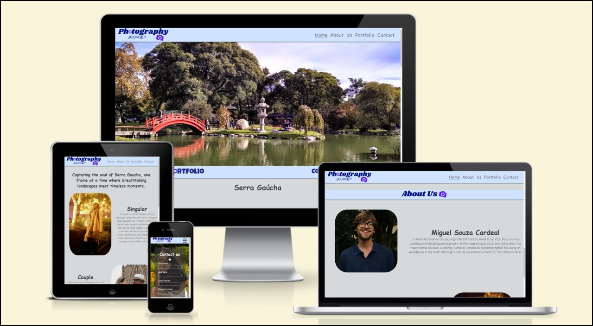

## Project Overview

### Purpose:

As part of a course project, this website serves as an educational resource, demonstrating the application of web development skills to create an engaging online platform. Through the lens of our friend's photography, we aim to explore HTML/CSS features, creating an accessible and responsive design.

### Existing Features

#### Navigation Bar

- Featured on all three pages of the website.
- Responsive navigation bar for easy navigation.
- Contains links to the Logo, Home, Gallery, and Contact pages. Clicking the Logo takes the user to the home page.

#### The landing page image

- The hero image contains a picture from Japanese gardens located in Gramado-RS.

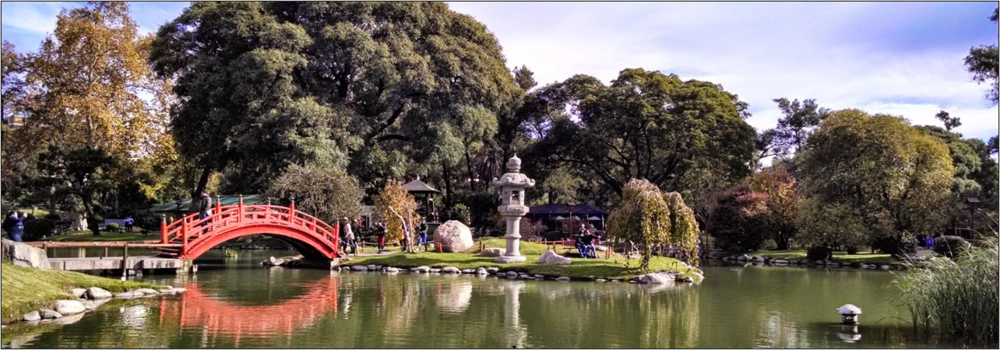

#### Middle Art Links

- Art is located in the middle of the page for easier interaction to move to the portfolio and contact.

#### The home page

- Serra Gaúcha section introduces the project and showcases the photographer's passion.
- About Us section explains the project owners' trajectory.

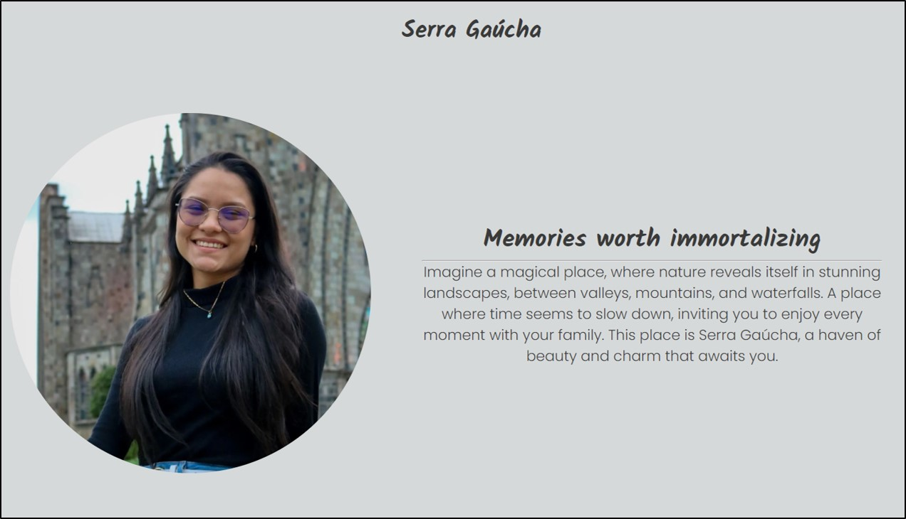
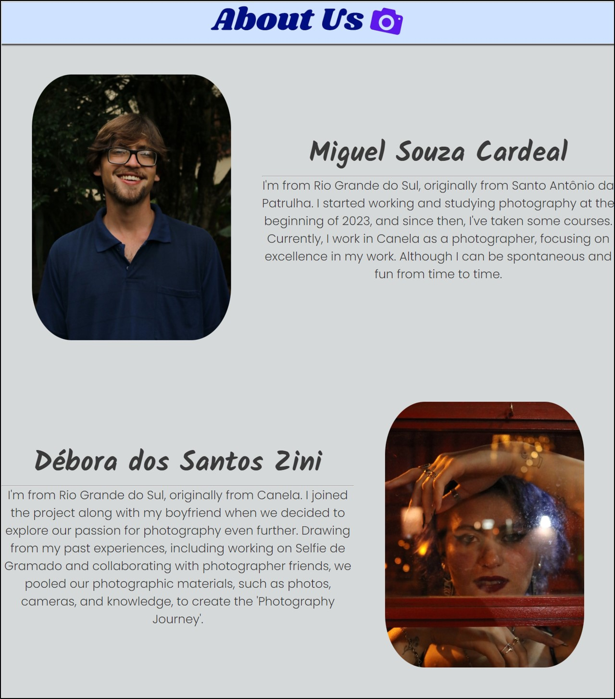

#### Portfolio page

- Quick tour through a few experiences and a showcase.

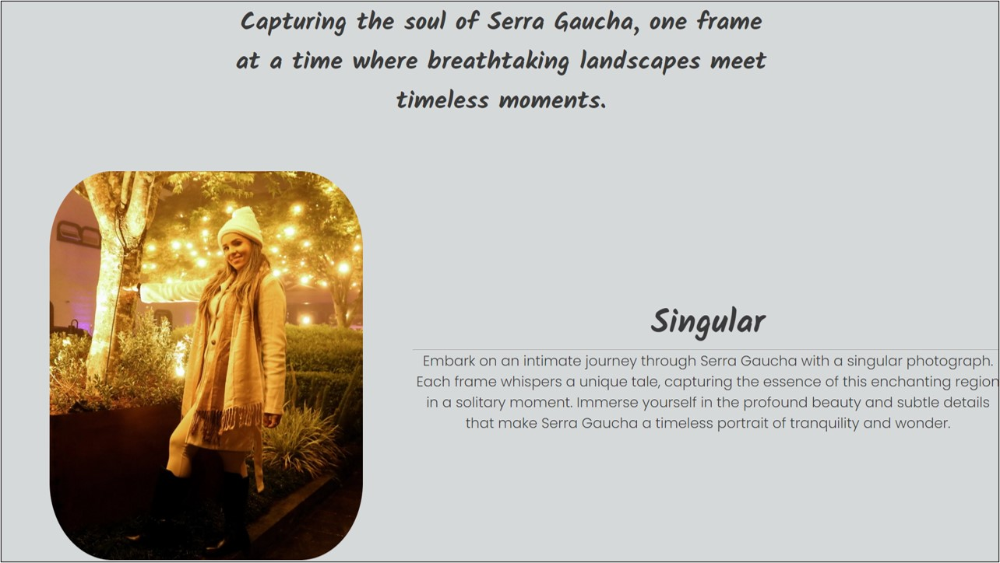

#### The contact page

- Background image and a complete contact form.

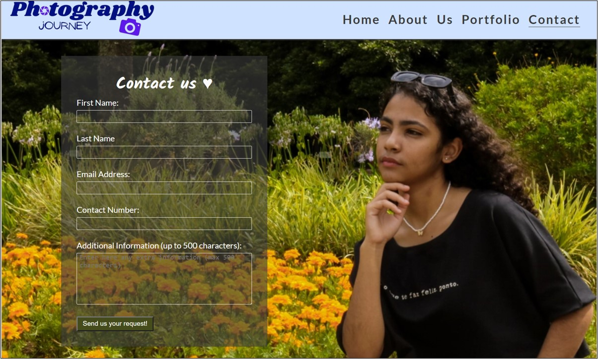

#### The footer section

- Contains clickable links to Facebook, Instagram, and Whatsapp for contact.

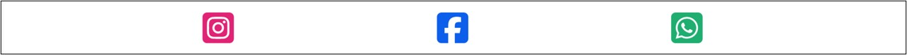

## Design

### Home Page Pre Design

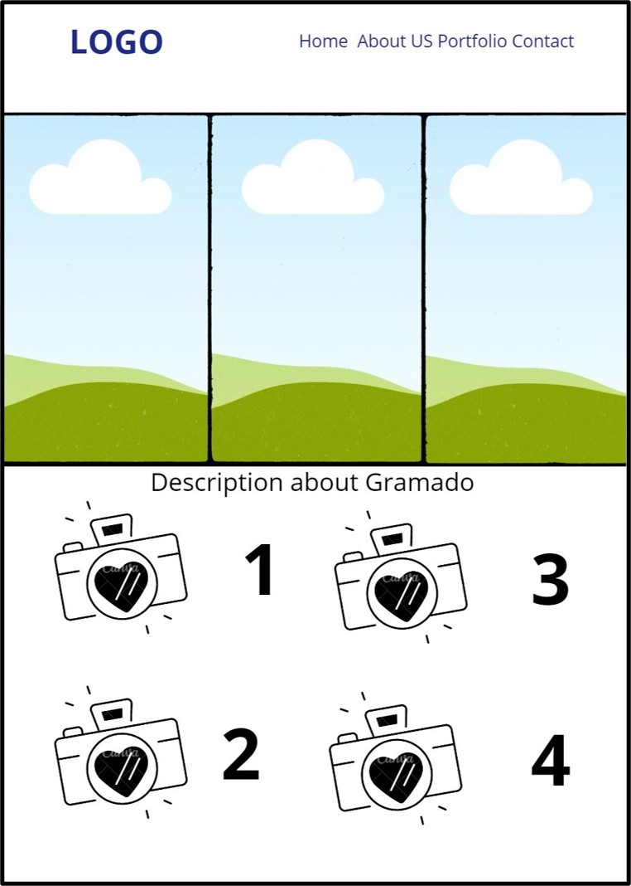

### About us Pre Design

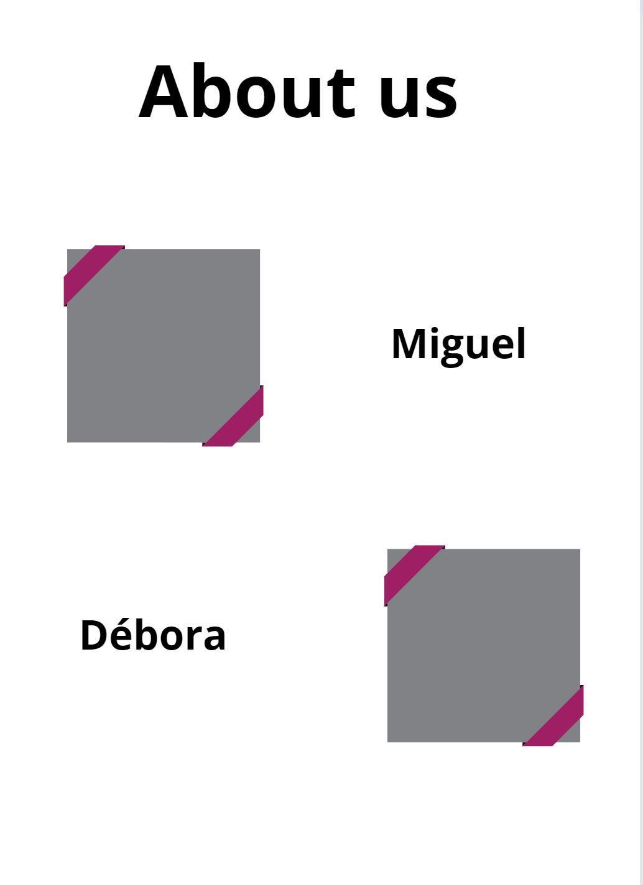

### Portfolio Pre Design

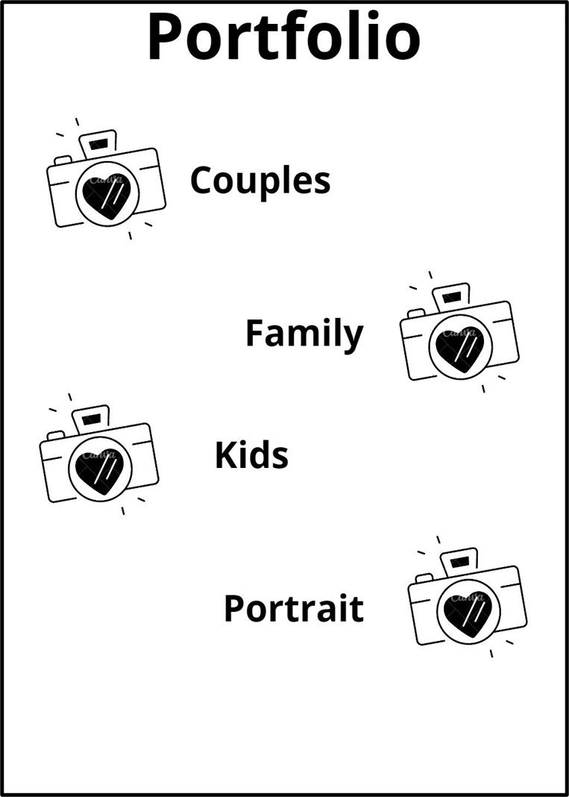

### Contact Pre Design

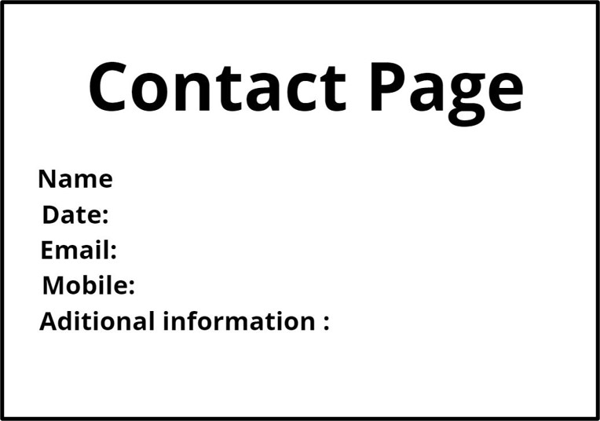

## Technologies

- HTML: The structure of the website.
- CSS: Styling using custom CSS.
- CodeAnywhere.com: Online IDE.
- GitHub: Source code hosting and deployment.
- Git: Version control.
- Font Awesome: Icons for social media links.
- Iloveimg: Image size reduction.
- Cloudconvert: Image format conversion.
- Favicon.io: Favicon creation.
- Canvas: Wireframes/Pre-design/Arts created using canvas from canva.com

## Future Enhancements

- Implementation of JavaScript for a better experience and more interactive design.
- Expansion of the portfolio with a single page for types of products.
- Creation of a confirmation page for the form sent.
- Multi-language support: Portuguese, English, Spanish.

## Testing

- Works on different browsers: Chrome, Microsoft Edge, Firefox.
- Responsive design on standard screen sizes using devtools device toolbar.
- Form features have been checked and work as expected.

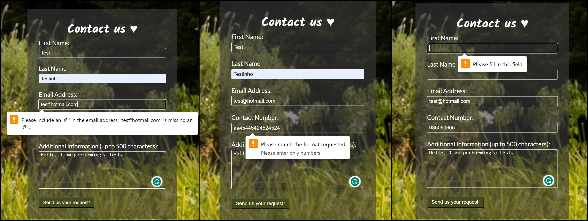
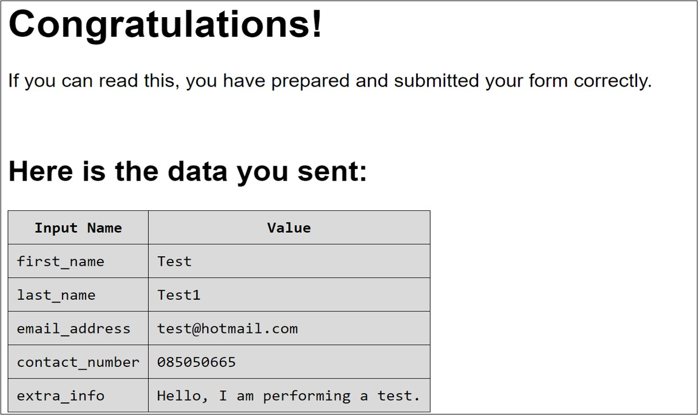

### Validator Testing

#### HTML

- [Home Page](https://validator.w3.org/nu/?doc=https%3A%2F%2Fvolneirj.github.io%2Fphotographermiguelcardeal%2F)
- [Portfolio Page](https://validator.w3.org/nu/?doc=https%3A%2F%2Fvolneirj.github.io%2Fphotographermiguelcardeal%2Fportfolio.html)
- [Contact Page](https://validator.w3.org/nu/?doc=https%3A%2F%2Fvolneirj.github.io%2Fphotographermiguelcardeal%2Fcontact.html)

#### CSS

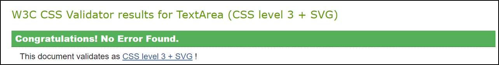

## Accessibility

- Images have three sizes for better performance on mobile or small screens.

### Home page accessibility

### Portfolio page accessibility

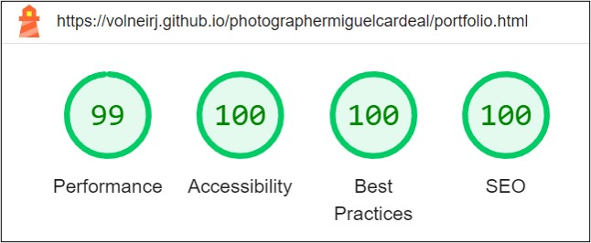

### Contact page accessibility

## Unfixed Bugs

No bugs were detected.

## Deployment

- Deployed to GitHub Pages.
- Live link: [GitHub Link](https://github.com/Volneirj/photographermiguelcardeal)

## Credits

1. Love running walkthrough from [Code Institute](https://learn.codeinstitute.net/).
2. **AI Search Engine:**
   - [OpenAI Chat](https://chat.openai.com/)
   - [Perplexity AI](https://www.perplexity.ai/)
3. **Readme References:**
   - [John Meditation GitHub](https://github.com/Joh201/john-meditation)
4. **Code Validation:**
   - [W3C Jigsaw Validator](https://jigsaw.w3.org/)

### Content

All content was created by Photography Journey, and all media were made by Miguel Cardeal. Permission was granted from Miguel Souza Cardeal (@Cardealfotografias).
