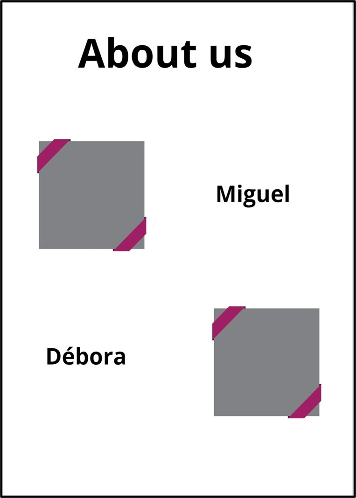

# ***Photograghy Journey***

Welcome to Photography Journey, where Miguel, our talented photographer, captures the spontaneous beauty of people in the enchanting Serra Gaúcha. Each click tells a unique story against the backdrop of this picturesque region, inviting you to explore genuine moments frozen in time. Join us on this visual adventure through Miguel's lens.

## **Project Overview**

## **Purpose:**

As part of a course project, this website serves as an educational resource, demonstrating the application of web development skills to create an engaging online platform. Through the lens of our friend's photography, we aim to explore HTML/CSS features, creating an accessible and responsive design.

## **Existing features**

### **Navigation Bar**

•	This is featured on all of the three pages of the website. The responsive navigation bar allows the user to move between the different pages easily without having to use the back button.
•	It contains links to the Logo of the page, the Home page, Gallery page and the Contact page. Furthermore, when the Logo is clicked it takes the user to the home page.

### **The landing page image**

•	The hero image contains a picture from japanese gardens which is located in Gramado-RS.

### **Middle Art Links**

• Art is located in the middle of the page for easier interaction to move to the portfolio and contact.

### **The home page**

The home page contains as two sections. 
•	The Serra Gaúcha section presents to the user the project and also shows the photographer passion for the place and for the photography.
•	The About Us section introduces the project owners trajectory, explaining where they come from and why they decided to to it.

### **Portfolio page**

• The content of this page is for a quick tour througth a few experiences and as a show case.

### **The contact page**

•	The contact page has a background image, also a complete contact form to the user ask questions or make quotes.

 A contact form will be implemented to allow users to contact 'Photography Journey'. The form will consist of the following fields and attributes:

 ►First Name (required, type=text)

 ►Last Name (required, type=text)

 ►Email (required, type=email)

 ►Phone (required, type=tel, patern=[0-9], inputmode= numeric)

 ►Message (required, type=textarea, max=500)
 
On successful submission of the contact form, the user will be navigated to contact.html displaying a success message Showing what data has been sent. 

### **The footer section**

•	This section contains clickable links to Facebook, Instagram and Whatsapp for contact

## **Design**

Home Page Pre Design

About us Pre Design

Portfolio Pre Design

Contact Pre Design

## **Technologies**

•	HTML
    ○The structure of the Website was developed using HTML as the main language.
•	CSS
    ○The Website was styled using custom CSS in an external file.
•	CodeAnywhere.com
    ○The website was developed using Codeanywhere online IDE
•	GitHub
    ○Source code is hosted on GitHub and delpoyed using Git Pages.
•	Git
    ○Used to commit and push code during the development opf the Website
•	Font Awesome
    ○Icons obtained from https://fontawesome.com/ were used as the Social media links in the footer section.
•	Iloveimg
    ○https://www.iloveimg.com/ was used to reduce the size of the images used throughout the website
•	Cloudconvert
    ○https://cloudconvert.com/ was used to convert imaged to webp
•	Favicon.io
    ○Favicon files were created at https://favicon.io/favicon-converter/
•	Canvas
    ○○ Wireframes/Pre design/ARts were created using canvas from canva.com

## **Testing**

•	This page works on different browsers: Chrome, Microsoft Edge, Firefox.

•	On smaller screen sizes the logo is located at the top of the navigation bar and has a toogle Navigation bar.

•	It have beem checked if is responsive, works and looks good on the standard screen sizes (ipad, MotoG4, iphone6/7/8, iphone5/SE and Galaxy S5) using the devtools device toolbar.

•	The form features have been checked and work as expected, the form requires entry on each field, and the email field accepts only email addresses, only numbers for phone numbers also the output has been tested as shown in the image below.

### **Validator Testing**

•	HTML
 	Validation links

[Home Page](https://validator.w3.org/nu/?doc=https%3A%2F%2Fvolneirj.github.io%2Fphotographermiguelcardeal%2F)

[Portfolio Page](https://validator.w3.org/nu/?doc=https%3A%2F%2Fvolneirj.github.io%2Fphotographermiguelcardeal%2Fportfolio.html)

[Contact Page](https://validator.w3.org/nu/?doc=https%3A%2F%2Fvolneirj.github.io%2Fphotographermiguelcardeal%2Fcontact.html)

•	CSS

## **Accessibility**

### **Home page accessibility**

### **Portfolio page accessibility**

### **Contact page accessibility**

## **Unfixed bugs**

No bugs were detected

## **Deployment**

• The site was deployed to GitHub pages as follows:

►In the GitHub repository, navigate to the Settings tab

►From the source section drop-down menu, select the Master or Main Branch

►Once the master or main branch has been selected, the page will be automatically 
refreshed with a detailed ribbon display to indicate the successful deployment.

►The live link can be found here: [GitHub Link](https://github.com/Volneirj/photographermiguelcardeal)

## **Credits**

### **Content**
