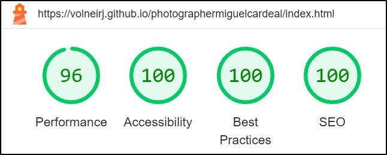
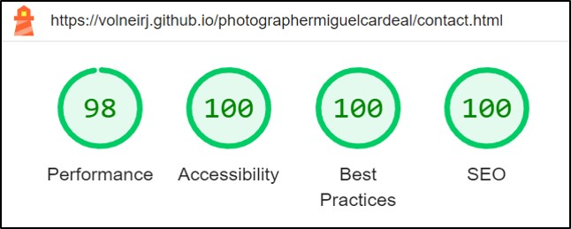

# Photography Journey

Welcome to Photography Journey, where Miguel, our talented photographer, captures the spontaneous beauty of people in the enchanting Serra Gaúcha. Each click tells a unique story against the backdrop of this picturesque region, inviting you to explore genuine moments frozen in time. Join us on this visual adventure through Miguel's lens.

[Photography Journey WebSite](https://volneirj.github.io/photographermiguelcardeal/)

## Project Overview

### Purpose:

As part of a course project, this website serves as an educational resource, demonstrating the application of web development skills to create an engaging online platform. Through the lens of our friend's photography, we aim to explore HTML/CSS features, creating an accessible and responsive design.

### Existing Features

#### Navigation Bar

- Featured on all three pages of the website.
- Responsive navigation bar for easy navigation.
- Contains links to the Logo, Home, Gallery, and Contact pages. Clicking the Logo takes the user to the home page.

#### The landing page image

- The hero image contains a picture from Japanese gardens located in Gramado-RS.

#### Middle Art Links

- Art is located in the middle of the page for easier interaction to move to the portfolio and contact.

#### The home page

- Serra Gaúcha section introduces the project and showcases the photographer's passion.
- About Us section explains the project owners' trajectory.

#### Portfolio page

- Quick tour through a few experiences and a showcase.

#### The contact page

- Background image and a complete contact form.

#### The footer section

- Contains clickable links to Facebook, Instagram, and Whatsapp for contact.

## Design

### Home Page Pre Design

### About us Pre Design

### Portfolio Pre Design

### Contact Pre Design

## Technologies

- HTML: The structure of the website.
- CSS: Styling using custom CSS.
- CodeAnywhere.com: Online IDE.
- GitHub: Source code hosting and deployment.
- Git: Version control.
- Font Awesome: Icons for social media links.
- Iloveimg: Image size reduction.
- Cloudconvert: Image format conversion.
- Favicon.io: Favicon creation.
- Canvas: Wireframes/Pre-design/Arts created using canvas from canva.com

## Future Enhancements

- Implementation of JavaScript for a better experience and more interactive design.
- Expansion of the portfolio with a single page for types of products.
- Creation of a confirmation page for the form sent.
- Multi-language support: Portuguese, English, Spanish.

## Testing

- The website has been tested changing the sizes and using navigation bar on follow browsers: Chrome, Microsoft Edge,Opera, Firefox.
- For mobile test, it has been tested using Google Chrome Devtools, also tested on my personal mobile Xiami 11 pro, on mobiles bigger than 768 pixels using the landscape mode the page contact could have a small issue where will be addressed in the Unfixed and fixed bugs topic.
- Responsive design on standard screen sizes using devtools device toolbar.
- On the contact page, on the form had been checked:
  1. Not accepted been sent missing information.
  2. The email input only accepted email format.
  3. The phone number only accepted numbers.
  4. The form information was been recorded correct.

### Validator Testing

#### HTML

- Using the [Markup Validation Service](https://validator.w3.org), through the URL option has been checked all pages and the results can be found bellow. During the tests few issues has been found and they will be adressed in the Unfixed and fixed bugs topic.

- [Home Page](https://validator.w3.org/nu/?doc=https%3A%2F%2Fvolneirj.github.io%2Fphotographermiguelcardeal%2F)
- [Portfolio Page](https://validator.w3.org/nu/?doc=https%3A%2F%2Fvolneirj.github.io%2Fphotographermiguelcardeal%2Fportfolio.html)
- [Contact Page](https://validator.w3.org/nu/?doc=https%3A%2F%2Fvolneirj.github.io%2Fphotographermiguelcardeal%2Fcontact.html)

#### CSS

- Using the [Markup Validation Service](https://validator.w3.org), through the direct input option the CSS code has been checked looking for errors.

## Accessibility

- Using the lighthouse Developer Tool from google Chrome, the performance, accessibility has been enchanced, also for better performance on small screems the images has been recized in three sizes, x-small, small, and the normal size.

### Home page accessibility

### Portfolio page accessibility

### Contact page accessibility

## Unfixed and fixed Bugs

  1. **Cache Control Performance Enhancement:**
     - **Issue**: After implementing cache control for performance enhancement, the webpage showed a slight improvement of 1 or 2 points. However, upon inspecting the HTML code, errors were found in the line where the cache control was implemented.
     - **Implemented Fix**: Considering it was showing an error when validate the html code. I decided to research and sort out this issue, as already implemented the cache control I did not want remove it, so I found someone with a similar issue on [StackOverFlow Forum](https://stackoverflow.com/questions/12498017/http-cache-headers-with-htaccess), and adpated it to my project adding the .htaccess to it.
     - **Visual Reference**
    

  2. **Landscape Mode Issue:**
     - **Issue**: Testing the website on Google Chrome in landscape mode revealed an issue affecting the contact page. Attempting to resolve this, a new media query for landscape was added. However, this had unintended consequences, deforming the image even on desktop.
     - **Proposed Fix**: Considering a future implementation for the final website version outside the course project, a potential solution is to change the background image to a wider one. This would eliminate the need for extensive control over its position.
     - **Visual Reference**
    

## Deployment

- **Deploying the project on Github**
  You can deploy this website by using GitPages and following the below steps:

  1. Log in to GitHub
  2. In your Repository section, select the project repository that you want to deploy
  3. In the menu located at the top of this section, click 'Settings'
  4. Select 'Pages' on the left-hand menu - this is around halfway down
  5. In the source section, select branch 'Main' and save
  6. The page is then given a site URL which you will see above the source section, it will look like the following:

- **Forking the GitHub Repository**
  If you want to make changes to your repository without affecting it, you can make a copy of it by 'Forking' it. This ensures your original repository remains unchanged.

  1. Find the relevant GitHub repository
  2. In the top right corner of the page, click the Fork button (under your account)
  3. Your repository has now been 'Forked' and you have a copy to work on

- **Cloning the GitHub Repository**
  Cloning your repository will allow you to download a local version of the repository to be worked on. Cloning can also be a great way to backup your work.

  1. Find the relevant GitHub repository
  2. Press the arrow on the Code button
  3. Copy the link that is shown in the drop-down
  4. Open the terminal 
  5. Move to the folder you want clone it
  6. In the terminal type 'git clone' & then paste the link you copied in GitHub
  7. Press enter and your local clone will be created.
- Live link: [GitHub Link](https://github.com/Volneirj/photographermiguelcardeal)

## Credits

1. **Base Code reference** 
    - I leveraged the Love Running project as a foundational template for developing my code. Drawing upon the knowledge acquired during the project walkthrough, I applied key concepts and techniques to tailor the code to my specific needs. Additionally, I referred to the source code for troubleshooting and resolving issues in my implementation. The Code Institute's learning platform [Code Institute](https://learn.codeinstitute.net/). served as a valuable resource throughout this process."
2. **AI Search Engine:**
   - [OpenAI Chat](https://chat.openai.com/)
   - [Perplexity AI](https://www.perplexity.ai/)
3. **Readme References:**
   - [John Meditation GitHub](https://github.com/Joh201/john-meditation)
   - [La Petite Traveller GitHub](https://github.com/daisygunn/la-petite-traveller)
4. **Code Validation:**
   - [W3C Jigsaw Validator](https://jigsaw.w3.org/)

### Content

All content was created by Photography Journey, and all media were made by Miguel Cardeal. Permission was granted from Miguel Souza Cardeal [@Cardealfotografias](https://www.instagram.com/cardealfotografias/).
